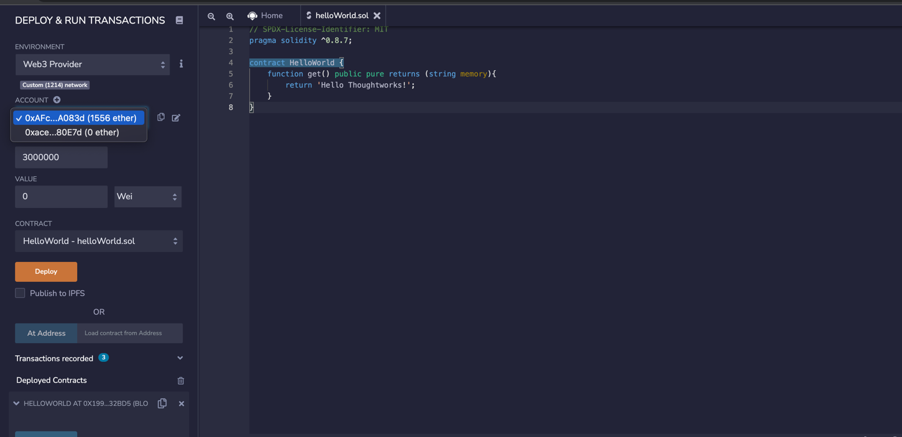

# Ethereum Basics

## Private Blockchain Setup

- Pre requisite is to have docker setup

- Start the nodes
```
docker-compose up -d
```

- Get All the accounts 
```
curl --location --request POST 'localhost:8545' \
--header 'Content-Type: application/json' \
--data-raw '{
    "jsonrpc": "2.0",
    "id": 2,
    "method": "eth_accounts",
    "params": []
}'
```

- Create a new account 
```
curl --location --request POST 'http://localhost:8545' \
--header 'Content-type: application/json' \
--data-raw '{
    "jsonrpc": "2.0",
    "id": 7,
    "method": "personal_newAccount",
    "params": [
        "9blockTWchain22"
    ]
}'
```

- See balance of accounts 
```
curl --location --request POST 'localhost:8545' \
--header 'Content-Type: application/json' \
--data-raw '{
    "jsonrpc": "2.0",
    "id": 4,
    "method": "eth_getBalance",
    "params": [
        "<account id>",
        "latest"
    ]
}'
```

- Unlock an account 
```
curl --location --request POST 'http://localhost:8545' \
--header 'Content-type: application/json' \
--data-raw '{
    "jsonrpc": "2.0",
    "id": 6,
    "method": "personal_unlockAccount",
    "params": [
        "<account id>",
        "9blockTWchain22"
    ]
}'
```

For more experimentation, refer - https://eth.wiki/json-rpc/API

---
## Deploy a Hello World Contract

- Go to Remix - https://remix.ethereum.org/

- Create a new helloWorld.sol file with below content

```
// SPDX-License-Identifier: MIT
pragma solidity ^0.8.7;

contract HelloWorld {
    function get() public pure returns (string memory){
        return 'Hello Thoughtworks!';
    }
}
````

- Compile it on remix

- Select environment as Web3 provider

- Select the account that has ether to pay the gas fees



- Unlock the account, using the following curl

```
curl --location --request POST 'http://localhost:8545' \
--header 'Content-type: application/json' \
--data-raw '{
    "jsonrpc": "2.0",
    "id": 6,
    "method": "personal_unlockAccount",
    "params": [
        "<account id>",
        "9blockTWchain22"
    ]
}'
```

! Note : `9blockTWchain22` is the account password here

- Deploy and run transactions


